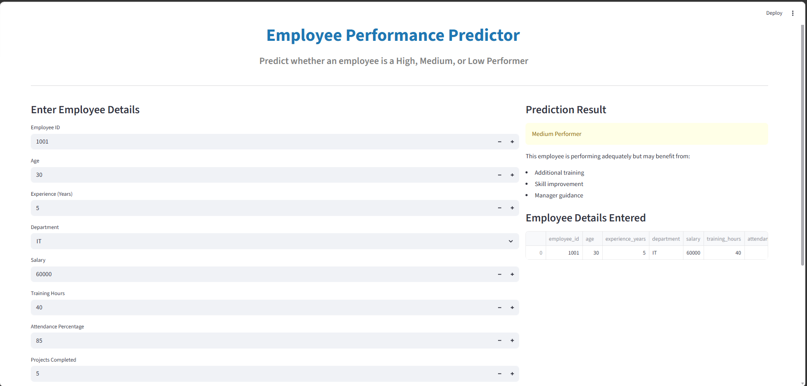
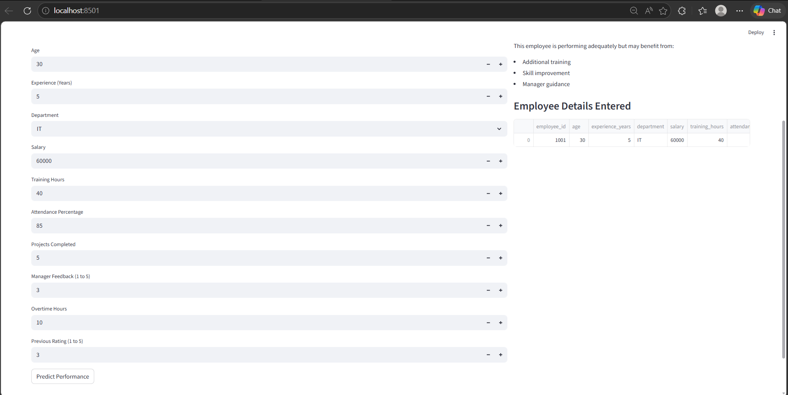
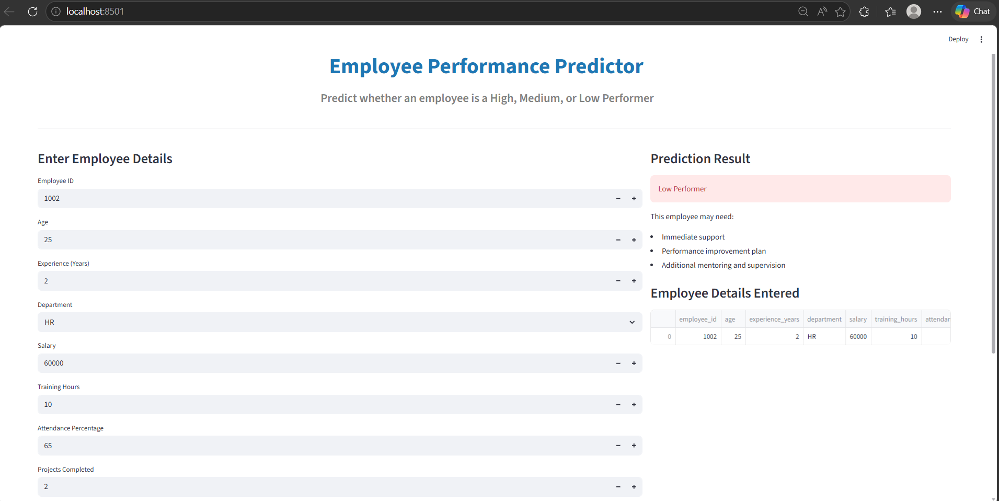
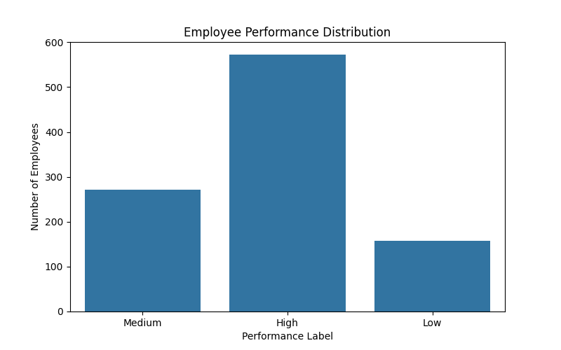
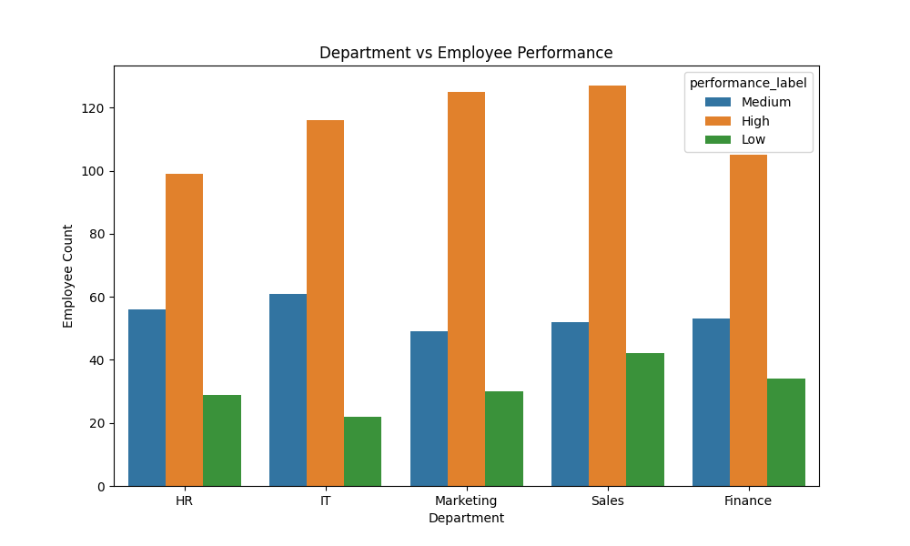
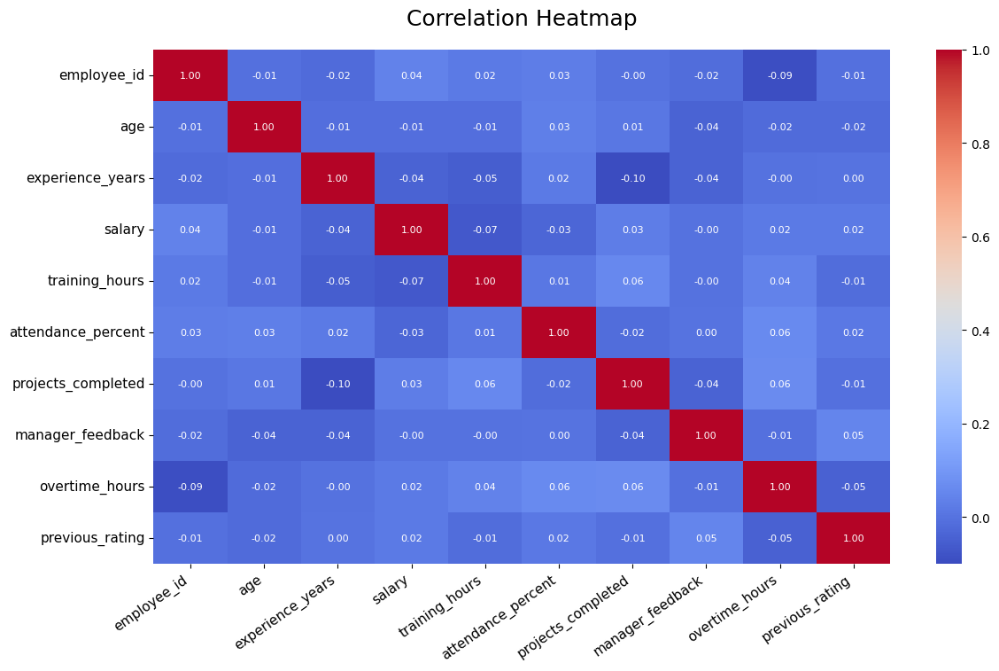

# Employee Performance Predictor Using Data Analytics

## Project Overview

Employee Performance Predictor is a machine learning project that predicts whether an employee is likely to be a High, Medium, or Low performer using HR-related data.

The project uses synthetic employee data because real company HR data is confidential and not publicly available. The system simulates a real company HR analytics environment and helps HR teams make better decisions about promotions, training, and employee improvement.

This project includes:

* Synthetic HR dataset generation
* Data preprocessing and cleaning
* Data visualization and analysis
* Machine learning model training
* Employee performance prediction
* Streamlit dashboard for interactive predictions

---

## Problem Statement

Companies often struggle to identify:

* Which employees are performing well
* Which employees need support or training
* Which employees may be suitable for promotion

Traditional performance reviews are manual and time-consuming. This project solves that problem by using machine learning to predict employee performance automatically.

The prediction classes are:

* High Performer
* Medium Performer
* Low Performer

---

## Business Value

This project can help HR teams and managers:

* Identify top-performing employees
* Detect employees who may need improvement
* Support promotion and reward decisions
* Plan training programs
* Improve employee retention
* Reduce manual work in performance evaluation

---

## Technologies Used

* Python
* Pandas
* NumPy
* Matplotlib
* Seaborn
* Scikit-learn
* Joblib
* Streamlit

---

## Project Structure

```text
Employee-Performance-Predictor-Using-Data-Analytics/
│
├── data/
│   ├── raw/
│   │   └── employee_data.csv
│   └── processed/
│       └── cleaned_employee_data.csv
│
├── images/
│   ├── Dashboard1.png
│   ├── Dashboard2.png
│   ├── Dashboard3.png
│   ├── performance_distribution.png
│   ├── department_performance.png
│   └── correlation_heatmap.png
│
├── models/
│   └── employee_performance_model.pkl
│
├── outputs/
│   ├── performance_distribution.png
│   ├── department_performance.png
│   └── correlation_heatmap.png
│
├── src/
│   ├── generate_data.py
│   ├── preprocess.py
│   ├── visualize.py
│   ├── train_model.py
│   ├── predict.py
│   └── app.py
│
├── requirements.txt
├── README.md
└── main.py
```

---

## Dataset Features

The synthetic dataset contains the following employee-related features:

* employee_id
* age
* experience_years
* department
* salary
* training_hours
* attendance_percent
* projects_completed
* manager_feedback
* overtime_hours
* previous_rating
* performance_label

The target variable is:

```text
performance_label
```

Possible values:

* High
* Medium
* Low

---

## Workflow

```text
Generate Dataset → Clean Data → Visualize Data → Train Model → Save Model → Predict Performance → Show Dashboard
```

---

## Machine Learning Model

The project uses a Random Forest Classifier.

Why Random Forest?

* Works well with mixed numerical and categorical data
* Gives high accuracy
* Handles non-linear relationships
* Suitable for beginner and industry-level projects

Model used:

```python
RandomForestClassifier(n_estimators=200, random_state=42)
```

---

## Model Accuracy

The trained Random Forest model achieved the following results on the test dataset:

```text
Accuracy: 78%

High Performer   → Precision: 0.82   Recall: 0.96   F1-Score: 0.88
Medium Performer → Precision: 0.60   Recall: 0.54   F1-Score: 0.57
Low Performer    → Precision: 0.94   Recall: 0.55   F1-Score: 0.69
```

The model provides balanced predictions across High, Medium, and Low performers based on employee experience, attendance, projects completed, manager feedback, training hours, and previous ratings.

## Visualizations Generated

The project generates the following graphs:

1. Performance Distribution Graph
2. Department vs Performance Graph
3. Correlation Heatmap

These graphs are stored inside the `outputs/` and `images/` folders.

---

## Streamlit Dashboard

The project also includes an interactive Streamlit dashboard.

Dashboard features:

* Enter employee details manually
* Predict employee performance instantly
* View employee summary
* User-friendly interface

Run the dashboard using:

```bash
streamlit run src/app.py
```

---

## How to Run the Project

Step 1: Install dependencies

```bash
pip install -r requirements.txt
```

Step 2: Generate synthetic employee dataset

```bash
python src/generate_data.py
```

Step 3: Preprocess and clean the dataset

```bash
python src/preprocess.py
```

Step 4: Generate visualizations

```bash
python src/visualize.py
```

Step 5: Train the machine learning model

```bash
python src/train_model.py
```

Step 6: Predict employee performance

```bash
python src/predict.py
```

Step 7: Run the Streamlit dashboard

```bash
streamlit run src/app.py
```

---

## Sample Prediction

Example employee input shown in Dashboard 2:

```text
Employee ID: 1001
Age: 30
Experience: 5 years
Department: IT
Salary: 60000
Training Hours: 40
Attendance Percentage: 85
Projects Completed: 5
Manager Feedback: 3
Overtime Hours: 10
Previous Rating: 3
```

Predicted Result:

```text
Medium Performer
```

---

## Screenshots

### Dashboard Preview







### Performance Distribution



### Department vs Performance



### Correlation Heatmap



---

## Future Improvements

- Use a larger and more realistic employee dataset collected from multiple departments
- Integrate real HRMS or employee management system data
- Improve prediction accuracy using advanced algorithms such as XGBoost or Gradient Boosting
- Add explainable AI techniques to show why a particular employee was predicted as High, Medium, or Low performer
- Build a more advanced Streamlit dashboard with charts and downloadable reports
- Add employee attrition prediction along with performance prediction
- Deploy the project online using Streamlit Cloud or Render
- Add role-based login for HR managers and employees
- Include monthly performance tracking and trend analysis
- Create a recommendation system that suggests training or improvement plans for each employee

---
## Author

Swetha K
